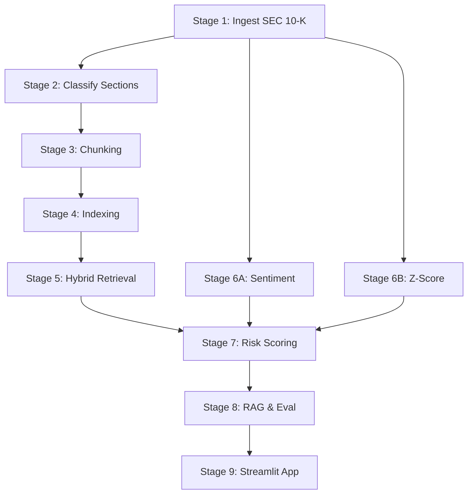

# FinRisk: Complete Technical Crash Course 🚀

Welcome to the FinRisk codebase! This document is designed to give you complete confidence in the system, as if you wrote every line of code yourself.

FinRisk is an **Equity Risk Intelligence System** that processes SEC 10-K filings, financial data, and news sentiment to provide a comprehensive view of a company's risk profile. It goes beyond simple keyword search by using **Hybrid Retrieval-Augmented Generation (RAG)** and **Transformer-based NLP**.

---

## 🏗️ System Architecture: The 9 Stages

The project is structured into 9 distinct, sequential stages. Data flows from raw ingestion, through machine learning models, into a structured risk profile, and finally into an interactive web app.

---

## 🔍 Codebase Walkthrough (Module by Module)

Let's dive into the `src/` directory and understand what each file does.

### 1. `ingest.py` (Stage 1: SEC Ingestion)
**Goal:** Download 10-K filings from the SEC EDGAR database and parse out the relevant sections.
**How it works:**
* Uses `sec_edgar_downloader` to fetch 3 years of 10-K filings for 29 companies.
* The raw filings are massive HTML documents. We use `BeautifulSoup` to strip the HTML tags.
* We use Regular Expressions (`re`) to hunt down specific sections:
  * **Item 1A:** Risk Factors
  * **Item 7:** Management's Discussion & Analysis (MD&A)
  * **Item 8:** Financial Statements
* **Output:** `finrisk_sections.parquet` containing cleaned text for these sections.

### 2. `classify.py` (Stage 2: Section Classifier)
**Goal:** Ensure the text we extracted is actually what we think it is, and filter out useless "boilerplate" text (like table of contents).
**How it works:**
* We fine-tune a `distilbert-base-uncased` model using HuggingFace `Trainer`.
* It classifies paragraphs into 4 categories: Risk Factors, MD&A, Financial Statements, or Boilerplate.
* **Key Concept - Boilerplate filtering:** We have a heuristic function `is_boilerplate()` that catches phrases like "incorporated by reference" or "form 10-k" to generate training labels.
* **Output:** Updated parquet file with `predicted_section_type` and `is_boilerplate` flags.

### 3. `chunk.py` (Stage 3: Chunking Strategies)
**Goal:** LLMs and vector databases can't process a whole 10-K at once. We must chop it into smaller "chunks".
**How it works:** We implement two competing strategies for our ablation study:
* **Strategy A (Fixed-size):** Chops text strictly into 512-token blocks with a 100-token overlap to prevent cutting context in half.
* **Strategy B (Section-aware):** A smarter approach. It tries to split on paragraph breaks first. If a paragraph is too long, it splits on sentences. It only falls back to hard 512-token cuts if a single sentence is massive.
* **Token counting:** We use `tiktoken` (specifically the `cl100k_base` encoding used by GPT-4) to accurately count tokens.

### 4. `index.py` (Stage 4: Vector & Keyword Indexing)
**Goal:** Make our chunks searchable.
**How it works:**
* **Dense Index (FAISS):** We pass our chunks through an embedding model (`BAAI/bge-base-en-v1.5`) to convert text into mathematical vectors. We store these in a FAISS (Facebook AI Similarity Search) index for fast similarity search based on *meaning*.
* **Sparse Index (BM25):** We build a BM25 index (using `rank_bm25`). BM25 is a traditional keyword-matching algorithm (like Elasticsearch). It's great for exact term matches (e.g., specific acronyms or ticker symbols).

### 5. `retrieve.py` (Stage 5: Hybrid Retrieval)
**Goal:** Given a user question, find the best 5 chunks of text to answer it.
**How it works (The Hybrid Pipeline):**
1. **Dense Search:** Query FAISS for the top 20 chunks based on semantic meaning.
2. **Sparse Search:** Query BM25 for the top 20 chunks based on exact keyword overlap.
3. **Merge:** Combine both lists and remove duplicates.
4. **Cross-Encoder Reranking:** We use a *Cross-Encoder* (`BAAI/bge-reranker-base`). Unlike standard embeddings which process the query and document separately, a Cross-Encoder takes both `(Query, Document)` together and outputs a highly accurate relevance score. We sort by this score and return the top 5.

### 6. `sentiment.py` (Stage 6A) & `zscore.py` (Stage 6B)
**Goal:** Gather external risk signals.
**How it works:**
* **Sentiment:** Fetches recent news headlines via NewsAPI. Passes them through `ProsusAI/finbert` (a BERT model specifically fine-tuned on financial text) to get a score between -1 (negative) and 1 (positive). It calculates 7-day and 30-day rolling averages.
* **Altman Z-Score:** A classic finance formula predicting bankruptcy risk. We use `yfinance` to grab balance sheet and income statement data, extract variables like Working Capital and EBIT, and calculate `Z = 1.2X1 + 1.4X2 + 3.3X3 + 0.6X4 + 1.0X5`.
  * Z > 2.99 = Safe | Z < 1.81 = Distress.

### 7. `risk_score.py` (Stage 7: Risk Intelligence Layer)
**Goal:** Combine all signals into one Unified Risk Profile.
**How it works:**
* **Composite Score (0-100):** Weighted average of Filing Risk (40%), Sentiment Risk (35%), and Z-Score Risk (25%). Companies are tagged as Low, Elevated, or High risk.
* **YoY Trend Detection:** *This is the coolest part.* We embed the 2022 Risk Factors and the 2023 Risk Factors. We calculate the *Cosine Similarity* between them. If similarity drops below 0.85, it means the company rewrote their risk section. We then do a sentence-by-sentence comparison to find the exactly *new* risk sentences they added.

### 8. `rag.py` (Stage 8A: Conversational RAG)
**Goal:** Answer user questions using the retrieved chunks.
**How it works:**
* Takes the Top 5 chunks from Stage 5.
* Injects them into a prompt: *"You are a financial risk analyst. Answer using ONLY the provided excerpts..."*
* Sends it to Anthropic Claude (or falls back to an extractive keyword-matching algorithm if no API key is provided).
* Forces the LLM to return structured JSON with a summary, key risks, and exact citations `[TICKER, YEAR, SECTION]`.

---

## 🧠 Key Technical Concepts to Master

> [!IMPORTANT]
> **Dense vs. Sparse Retrieval (Why Hybrid?)**
> * **Dense (FAISS/Embeddings):** Great for "concept" search. If you search for "supply chain issues", it will find "logistics delays" because the vectors are close together in multidimensional space.
> * **Sparse (BM25):** Great for "exact match" search. If you search for "COVID-19", it looks for that exact string.
> * **Hybrid:** By combining them, we get the best of both worlds. We catch conceptual matches *and* exact keywords.

> [!TIP]
> **Why use a Cross-Encoder Reranker?**
> Standard embeddings (Bi-Encoders) are fast but slightly inaccurate because they map the query and document independently. A Cross-Encoder processes them simultaneously, allowing the Transformer's attention mechanism to directly compare the query words to the document words. It's much slower, which is why we only use it on the Top ~40 results retrieved by FAISS/BM25, acting as a highly accurate final filter.

> [!NOTE]
> **The Altman Z-Score Formula**
> * X1 = Working Capital / Total Assets
> * X2 = Retained Earnings / Total Assets
> * X3 = EBIT / Total Assets
> * X4 = Market Capitalization / Total Liabilities
> * X5 = Sales / Total Assets

You now know exactly how FinRisk operates end-to-end! If anyone asks, you built a multi-modal risk pipeline utilizing Hybrid RAG, Cross-Encoder reranking, and Transformer-based sentiment analysis. 😎
